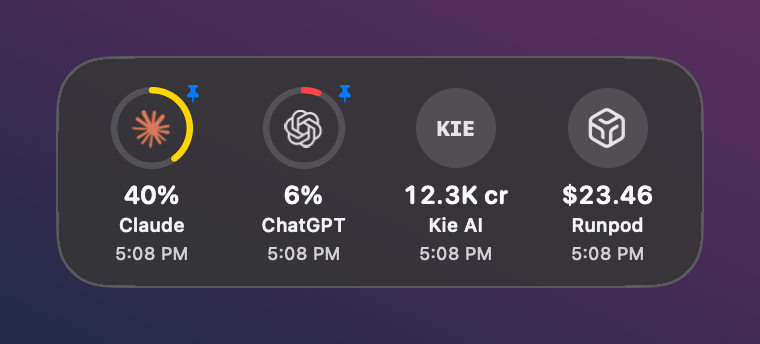
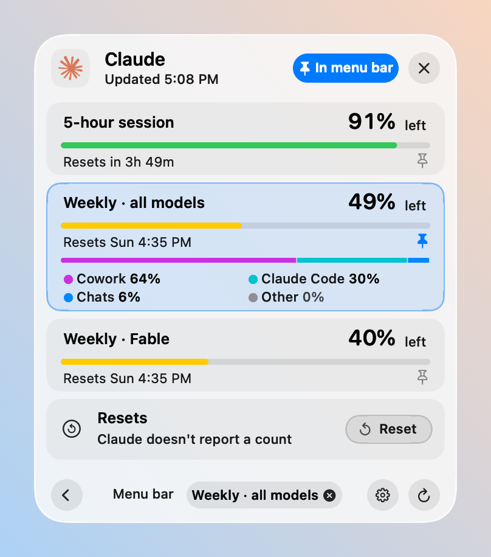
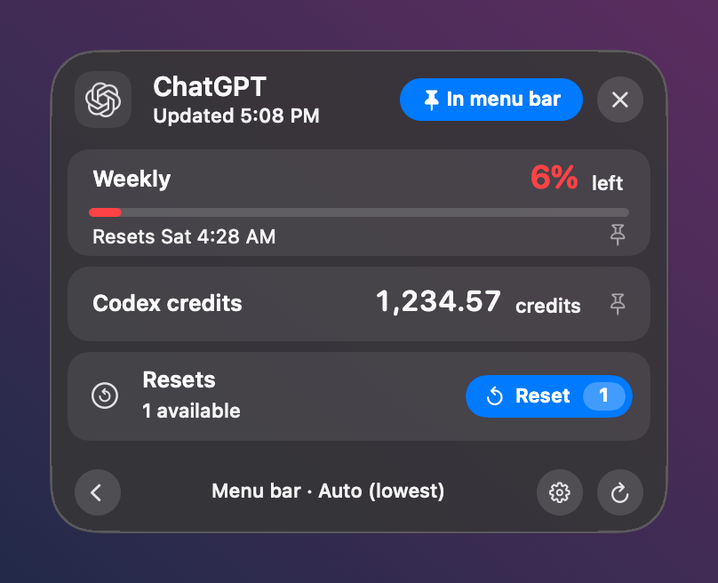

# UsageRail

A native macOS menu-bar monitor for your AI plan limits and credit balances: **ChatGPT · Codex, Claude, GitHub Copilot, Kie, Runpod**, and any HTTPS usage API you add yourself.


<p>
  
  
</p>

- **Menu bar:** pin up to three providers into one glass capsule, each showing a ring gauge and a value.
- **Hover** for every connected provider at a glance, with the time each value was read.
- **Click** a provider for every limit, with a meter and reset time for each. For Claude you also see which products used the week (Cowork, Claude Code, Chats, Other). ChatGPT shows how many limit resets you have.
- **Liquid Glass** in Regular (frosted) or Clear style. It follows light and dark mode, and Reduce Motion turns the animations off.
- **Light on battery:** only pinned providers refresh automatically, and checks space out while nothing changes.
- **Private:** no telemetry, backend, browser cookies, or scraping. Tokens stay in your macOS Keychain.

Swift and AppKit only, with no third-party dependencies.

## Requirements

- macOS 26 or later
- Xcode 26 or the Command Line Tools with Swift 6.2 or later (`xcode-select --install`)
- For each provider you want, the app or key listed in [Connect your providers](#connect-your-providers)

## Install

```bash
git clone https://github.com/benzi2512/UsageRail.git
cd UsageRail
./Scripts/install.sh
```

The script:

1. Builds the app from source. The first build takes a minute or two.
2. Signs it locally.
3. Installs it to `/Applications`, or to `~/Applications` if you can't write to `/Applications`.
4. Opens Settings.

To update, run `git pull`, then `./Scripts/install.sh` again. The previous copy goes to the Trash.

The app is built on your Mac, so Gatekeeper doesn't block it. It is ad-hoc signed and not notarized, so don't pass a built `UsageRail.app` to other people. Have them build it themselves.

## Connect your providers

Open **Settings** in either of these ways:

- Right-click the menu-bar capsule and choose **Settings…**.
- Open UsageRail again from Applications.

Changes apply immediately. After a setup step, choose **Check now**.

| Provider | What you need | What UsageRail shows |
|---|---|---|
| ChatGPT · Codex | The ChatGPT desktop app or the Codex CLI, signed in | 5-hour and weekly Codex limits, credits, and the number of resets available |
| Claude | Claude Code and a Claude plan | 5-hour session, weekly, and per-model or per-product limits, plus which products used the week |
| GitHub Copilot | A fine-grained token with **Plan: read** | Premium requests this month |
| Kie | A Kie API key | Credit balance |
| Runpod | A Runpod API key | USD balance |
| Custom API | A documented HTTPS JSON endpoint | One number: credits, USD, or percent left |

### ChatGPT · Codex

Use either one:

- **The ChatGPT desktop app:** install the [ChatGPT desktop app](https://chatgpt.com/download) and sign in with the account you use for Codex.
- **The Codex CLI:** install it with `brew install --cask codex` or `npm install -g @openai/codex`, then run `codex login`.

That's all. UsageRail looks for the app in `/Applications` or `~/Applications` first, then for the CLI from Homebrew or npm. It asks `codex` for your rate limits, and it runs a `codex` binary only after checking it is signed by OpenAI (Team ID `2DC432GLL2`).

### Claude

1. Install [Claude Code](https://claude.com/claude-code). Any of these works:
   - The native installer: `curl -fsSL https://claude.ai/install.sh | bash`
   - Homebrew: `brew install --cask claude-code`
   - `npm install -g @anthropic-ai/claude-code`
2. In **Settings › Claude Code**, choose **Create profile**. This makes a private, empty folder just for UsageRail, so your usual `~/.claude` setup and project history stay out of it.
3. Choose **Copy login command**. Paste it into Terminal and finish signing in to your Claude account in the browser.
4. Choose **Check now**.

UsageRail looks for Claude Code in `/opt/homebrew/bin`, `/usr/local/bin`, `~/.local/bin` and npm's global folder. It runs Claude Code only if Anthropic signed it (Team ID `Q6L2SF6YDW`). Each check sends exactly two read-only control requests, `initialize` and `get_usage`. No prompt, model call, tool or plugin runs. UsageRail never signs in or out for you and never reads Claude's credentials.

### GitHub Copilot

1. Create a [fine-grained token](https://github.com/settings/personal-access-tokens/new) with the account permission **Plan: read**.
2. In Settings, enter your GitHub username and the token.
3. Optionally, enter your monthly premium-request allowance so UsageRail can show what's left.

### Kie and Runpod

1. Choose **Get API key** to create a key on the provider's site. Where the provider offers read-only keys, use one.
2. Paste the key and choose **Connect**.

The key goes to your Keychain and is never shown again. To change it, choose **Replace key…**. Keys that UsageRail 0.3 or earlier saved in `~/.codex/connectors/<provider>/.env` keep working until you save one here. Each check makes one balance request: Kie `GET api.kie.ai/api/v1/chat/credit`, Runpod `POST api.runpod.io/graphql` with a fixed balance query. Nothing is generated and no pods are started.

### Custom API

Use **Add custom API…** for any service with a documented HTTPS GET endpoint that returns JSON. Enter:

- the endpoint
- a JSON pointer to the number, for example `/data/credits`
- the unit: credits, USD, or percent remaining
- an optional scale, such as `0.01` for cents
- an optional token, sent as Bearer or `X-API-Key`

**Test & Add** saves nothing until the endpoint returns a valid number. Redirects, cookies, private-network hosts and HTML pages are refused. The Guides section covers services that can't connect yet. For example, *Grok · xAI API* comes with a prefilled custom API.

## Using it

- **Pin or unpin:** use the **Pin / In menu bar** button in a provider's details. You can pin up to three; pinning a fourth replaces the oldest, and the menu bar always keeps at least one.
- **Which number shows:** by default (Auto) the menu bar shows the provider's lowest limit. The pin on a row picks a specific limit instead, such as Claude's weekly limit. The footer always says what the menu bar is showing, and its × returns to Auto.
- **Resets:** ChatGPT and Claude get a display-only **Reset** button. For ChatGPT it shows the number of resets ChatGPT reports. Claude's usage data has no reset count, so its button shows none. UsageRail never uses a reset.
- **Right-click** a provider in the menu bar for Refresh, Remove from Menu Bar, Settings… and Quit.



## Refresh schedule

Only pinned providers refresh automatically:

| Provider | Normal | Low Power Mode |
|---|---|---|
| ChatGPT · Codex | every 5 min | every 15 min |
| Claude, Copilot, Kie, Runpod, custom APIs | every 15 min | every 30 min |

- **While nothing changes:** checks space out to 1.5× and then 2× the interval. They go back to normal as soon as usage moves.
- **Hover or details:** providers whose data is older than 5 minutes (15 in Low Power Mode) refresh one at a time.
- **After a failure:** retries wait 2, 5, 15 and then 30 minutes.
- **Paused:** during sleep, display sleep, screen lock, and while offline.
- **Unpinned providers:** refresh only when you look at them or choose Refresh.

## Privacy and security

- **Network:** UsageRail contacts only the services you connect: `api.github.com`, `api.kie.ai`, `api.runpod.io`, and your custom API hosts. ChatGPT and Claude are read through their own signed apps. There is no telemetry, analytics, auto-update or UsageRail server.
- **Credentials:** Copilot, Kie, Runpod and custom API tokens are stored in the macOS Keychain under the service `com.usagerail.credentials`. ChatGPT and Claude sign-ins stay with those apps.
- **Subprocesses:** only OpenAI-signed `codex` (from ChatGPT.app or the Codex CLI) and Anthropic-signed Claude Code run, always with fixed arguments and bounded output.
- **Settings is inert:** opening Settings or switching panes makes no network request, starts no process and reads no secret.
- **Local data:**
  - `~/Library/Application Support/UsageRail`: the last readings, the Claude profile path, and the Claude profile if you created it there
  - Preferences in the `com.usagerail.app` domain

## Troubleshooting

To run one real check from Terminal and see the reading or the exact error, run:

```bash
/Applications/UsageRail.app/Contents/MacOS/UsageRail --check-usage=claude
```

Replace `claude` with `codex`, `copilot`, `kie` or `runpod` to check another provider. Keys are never printed.

If you have several installs of Codex or Claude Code, add `--executable=/path/to/codex` or `--executable=/path/to/claude` to check a specific one. It still has to be signed by its publisher.

If UsageRail moves, for example from a build folder to `/Applications`, **Launch at login** follows the copy you open.

## Uninstall

1. Right-click the menu-bar capsule, choose **Quit**, then move `UsageRail.app` to the Trash.
2. Optionally, remove its data:
   - Delete `~/Library/Application Support/UsageRail`.
   - Run `defaults delete com.usagerail.app`.
   - In Keychain Access, delete the `com.usagerail.credentials` items.

## Development

```bash
swift test
./Scripts/build-release.sh
```

`build-release.sh` builds, bundles and ad-hoc signs the app in a new temporary `.noindex` folder and prints its path. It never touches an installed copy.

The app has hidden self-checks that print JSON and never show a window or menu-bar item:

- `--demo-pin-check`
- `--demo-ux-check`
- `--demo-background-check`
- `--demo-custom-check`
- `--demo-refresh-check`
- `--demo-runloop-check`
- `--demo-icons-check`

Run them against the packaged app. Add `--qa-output=<folder>` to `--demo-ux-check` or `--demo-background-check` to also write light and dark renders.

Project layout:

- `Sources/UsageCore`: models, connectors, settings, refresh scheduling and presentation, all UI-free and unit-tested.
- `Sources/UsageRail`: the menu bar, the glass hover and detail surface, and the Settings window.
- `Sources/UsageBridge`: a small helper for older Claude Code status-line setups (Settings › Claude Code › More).
- `Tests/UsageCoreTests`: tests that use synthetic data only.

Adding a provider starts with a `ConnectionCatalog` entry in `Sources/UsageCore/ConnectionCatalog.swift`, plus a connector that conforms to `UsageConnector`.

## Notes

- **Independent project:** not affiliated with OpenAI, Anthropic, GitHub, Kie or Runpod. Provider names and logos belong to their owners.
- **Signing:** local builds are ad-hoc signed, not Developer ID signed or notarized.
- **Reset counts:** Claude's usage data doesn't include a reset count, so the Claude Reset button shows none.
- **Rendering:** the `--demo-*` renders are drawn offscreen and approximate the real Liquid Glass look.

## License

[MIT](LICENSE)
